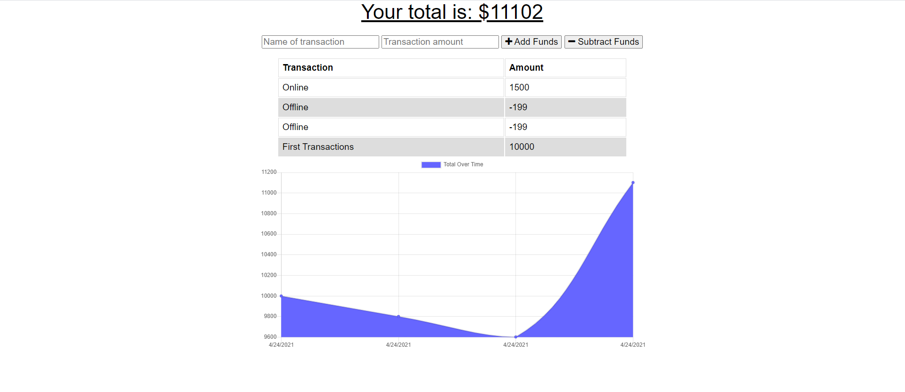

# Online-Offline-Budget-Trackers

Budget Trackers is a project that allow the user to add and subtract fund offline and save, then when the user go back online, those data is then added to the database.

[Application Link](https://bootcamp-budget-trackers.herokuapp.com/)

